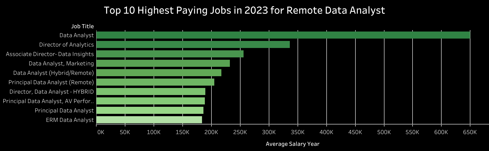
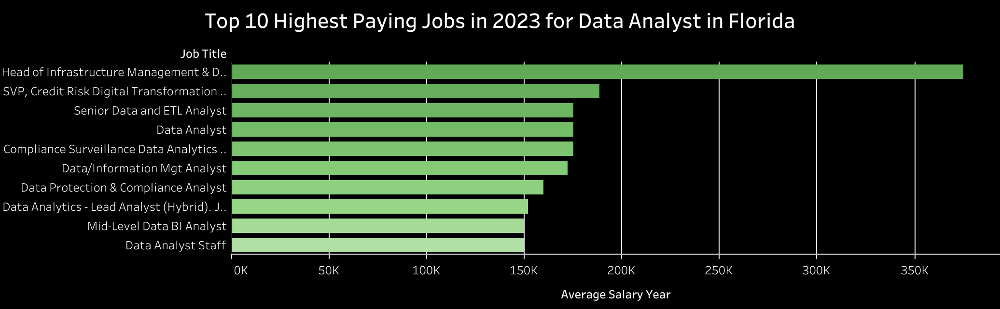
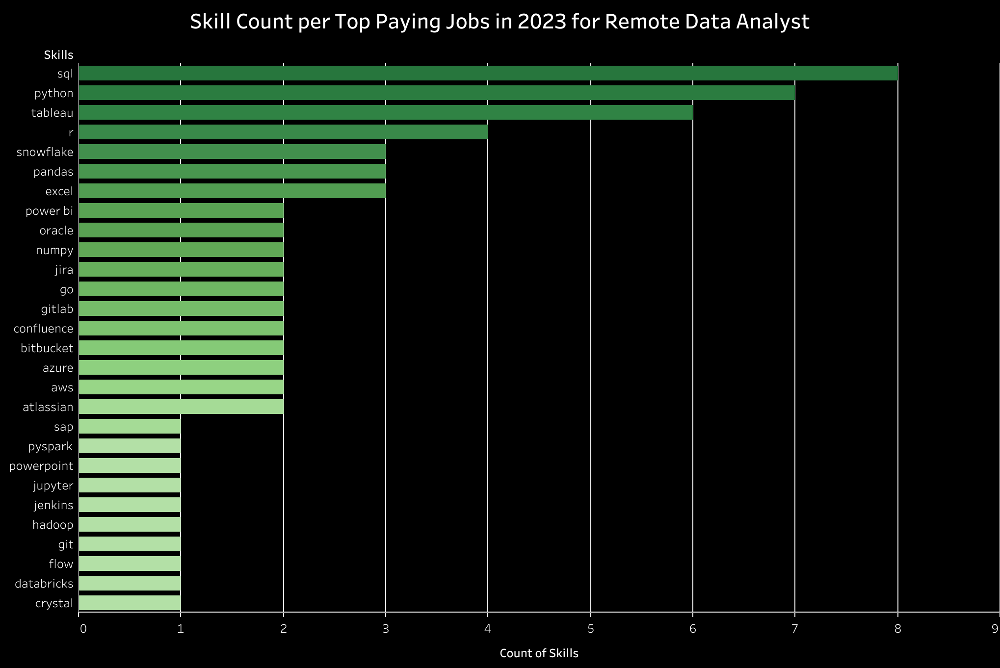
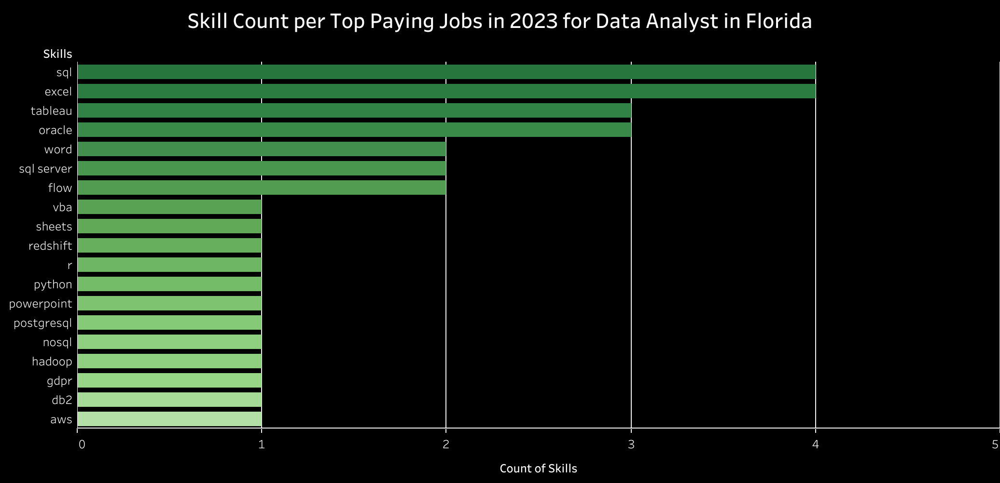

# Introduction

Hello, welcome to my Analysis on the 2023 job market. This analysis project focuses on top-paying jobs, in-demand skills, and where high demand meets high salary for data analyst roles.

This analysis project was inspired by Luke Barousse and driven by my desire to find the top-paying and in-demand skills for myself and others to help navigate the data analysis job market.

- The data comes from Luke Barousse: [CSV Dataset Folder](https://drive.google.com/drive/folders/1egWenKd_r3LRpdCf4SsqTeFZ1ZdY3DNx)

- Looking for the SQL queries, check out this link: [project_sql folder](/project_sql/)

### The questions I wanted to answer through my analysis were:
- What are the top-paying data analyst jobs?
- What skills are required for the top-paying data analyst jobs?
- What are the skills most in demand by a data analyst?
- What are the top skills based on salary?
- What are the most optimal skills to learn for a data analyst?


# Tools I Used
For my analysis, I used these specific key tools to help improve my skills on my journey to become a data analyst:
- SQL
- PostgreSQL
- Visual Studio Code
- Tableau
- Git & GitHub

# The Analysis
The questions that I want to answer for this analysis are to help me navigate the job market. I'm specifically looking for data analyst jobs. Here is how I approached each question:

### 1) What are the top-paying data analyst jobs?
To identify the top-paying jobs, I queried the average yearly salary, and filtered the location. Once by remote jobs and second by my local location, I live in Florida.

*Below are the queries:*
``` sql
SELECT
    job_id,
    company_dim.name AS company_name,
    job_title,
    job_location,
    salary_year_avg,
    job_posted_date
FROM
    job_postings_fact
        LEFT JOIN company_dim ON job_postings_fact.company_id = company_dim.company_id
WHERE
    job_title_short = 'Data Analyst' 
    AND job_location = 'Anywhere' -- remote
    AND salary_year_avg IS NOT NULL
ORDER BY
    salary_year_avg DESC
LIMIT 10;
```
*This query is filtering the top 10 jobs for only data analyst and remote positions*


*This graph was created in Tableau to easily visualize the query*

We can see that there is a wide range of salaries among positions related to data analyst. The average highest paid job is Data Analyst, coming in at $650,000 a year, dropping around to $184,000 a year. This shows there is significant salary potential. There is also a wide range of data analyst roles such as Director of Analytics, Marketing Data Analyst, and even ERM Data Analyst. There is a lot of exploring for a data analyst.

Now let's switch the filter to help me locally. To do that, I only need to change the job comparison to look for cities in Florida.

``` sql
SELECT
    job_id,
    company_dim.name AS company_name,
    job_title,
    job_location,
    salary_year_avg,
    job_posted_date
FROM
    job_postings_fact
        LEFT JOIN company_dim ON job_postings_fact.company_id = company_dim.company_id
WHERE
    job_title_short = 'Data Analyst' 
    AND job_location LIKE '%, FL' -- local
    AND salary_year_avg IS NOT NULL
ORDER BY
    salary_year_avg DESC
LIMIT 10;
```
*This query is filtering the top 10 jobs for only data analyst and local positions to me*


*This graph was created in Tableau to easily visualize the query*

For this query we have a dramatic change. The new highest yearly salary average is $375,000 to $150,000. This is because we are looking at a specified location instead of anywhere. So if I want a higher yearly salary, I would need to look outside of Florida. There is still a wide variety of jobs from the Head of Infrastructure and Management & Data Analysis to Mid-Level BI Analyst.

### 2) What skills are required for the top-paying data analyst jobs?

To find the required skills for the highest-paying job, I need to join more datasets. I already know the highest-paying jobs and will keep it as a subquery for my new query. I need to filter the different skills associated with these highest paying jobs.

*Below are the queries:*

``` sql
WITH top_paying_jobs AS(
    SELECT
        job_id,
        company_dim.name AS company_name,
        job_title,
        salary_year_avg
    FROM
        job_postings_fact
        LEFT JOIN company_dim ON job_postings_fact.company_id = company_dim.company_id
    WHERE
        job_title_short = 'Data Analyst'
        AND job_location = 'Anywhere' -- remote
        AND salary_year_avg IS NOT NULL
    ORDER BY
        salary_year_avg DESC
    LIMIT 10
)

SELECT 
    top_paying_jobs.*,
    skills_dim.skills
FROM 
    top_paying_jobs
    INNER JOIN skills_job_dim ON top_paying_jobs.job_id = skills_job_dim.job_id
    INNER JOIN skills_dim ON skills_job_dim.skill_id = skills_dim.skill_id
ORDER BY
    salary_year_avg DESC;
```


*This graph was created in Tableau to visualize the skill count for the highest paying remote jobs*

We can see from the query that SQL, Python, and Tableau are the top three skills that are used for the highest-paying remote jobs. SQL is used in eight out of the top ten, and Python is used in seven out of ten. This makes SQL the most valued skill for data analysts. Following the top three skills, we have R, Snowflake, Pandas, and Excel. These are important skills, but just not as highly valued.

Now I want to change the focus of the job location to Florida.

``` sql
WITH top_paying_jobs AS(
    SELECT
        job_id,
        company_dim.name AS company_name,
        job_title,
        salary_year_avg
    FROM
        job_postings_fact
        LEFT JOIN company_dim ON job_postings_fact.company_id = company_dim.company_id
    WHERE
        job_title_short = 'Data Analyst'
        AND job_location LIKE '%, FL' -- local
        AND salary_year_avg IS NOT NULL
    ORDER BY
        salary_year_avg DESC
    LIMIT 10
)

SELECT 
    top_paying_jobs.*,
    skills_dim.skills
FROM 
    top_paying_jobs
    INNER JOIN skills_job_dim ON top_paying_jobs.job_id = skills_job_dim.job_id
    INNER JOIN skills_dim ON skills_job_dim.skill_id = skills_dim.skill_id
ORDER BY
    salary_year_avg DESC;
```


*This graph was created in Tableau to visualize the skill count for the highest paying Florida jobs*

In this query, there is a fewer skill count. The top skills are SQL, Excel, Tableau, and Oracle. The following skills are Word, SQL Server, and Flow. With this, we can see a slight skill change focus by location. However, SQL and Tableau are essential skills in the highest-paying jobs in Florida.

### 3) What are the skills most in demand by a data analyst?

For this question I am expanding my search. I want the frequently requested skill in a job posting. To do that, I need to aggregate the skills per job.

*Below is the SQL query and table:* 
``` sql
SELECT 
    skills,
    COUNT(skills_job_dim.job_id) AS demand_count
FROM 
    job_postings_fact
    INNER JOIN skills_job_dim ON job_postings_fact.job_id = skills_job_dim.job_id
    INNER JOIN skills_dim ON skills_job_dim.skill_id = skills_dim.skill_id
WHERE
    job_title_short = 'Data Analyst'
GROUP BY
    skills
ORDER BY 
    demand_count DESC
LIMIT 10;
```
<div align="center">
<strong>Top 10 Skills in High Demand</strong>

| Skill          | Demand Count |
|----------------|--------------|
| SQL            | 92628        |
| Python         | 67031        |
| Excel          | 57326        |
| Tableau        | 46554        |
| Power BI       | 39468        |
| R              | 30075        |
| Sas            | 28068        |
| Powerpoint     | 13848        |
| Word           | 13591        |
| Sap            | 11297        |

</div>

SQL and Tableau are near the top of the list again, making these skills essential for a data analyst. We can also see Python, Excel, R, and Power BI are vital technical skills to learn.

### 4) What are the top skills based on salary?

For this query, I wanted to know which skills are the highest paying based on average yearly salary. I am not focusing on location again, because I want to know for the future what skills I should learn for a higher pay raise.

*Below is the SQL query and table:*
``` sql
SELECT 
    skills,
    ROUND(AVG(salary_year_avg), 2) AS average_salary
FROM 
    job_postings_fact
    INNER JOIN skills_job_dim ON job_postings_fact.job_id = skills_job_dim.job_id
    INNER JOIN skills_dim ON skills_job_dim.skill_id = skills_dim.skill_id
WHERE
    job_title_short = 'Data Analyst'
    AND salary_year_avg IS NOT NULL
GROUP BY
    skills
ORDER BY 
    average_salary DESC
LIMIT 10;
```
<div align="center">
<strong>Highest Yearly Average Salary of the Top 10 Skills for Data Analyst</strong>

| Skill          | Average Salary ($) |
|----------------|--------------------|
| SVN            | 400,000.00 |
| Solidity       | 179,000.00 |
| Couchbase      | 160,515.00 |
| Datarobot      | 155,485.50 |
| Golang         | 155,000.00 |
| MXNet          | 149,000.00 |
| Dplyr          | 147,633.33 |
| VMware         | 147,500.00 |
| Terraform      | 146,733.83 |
| Twilio         | 138,500.00 |

</div>

From the table I see a lot of skills I don’t know and a few I do know. So I had to do some internet searching. Skills like Terraform, Golang, and VMware help improve cloud storage. Datarobot and MXNet are helpful machine learning tools for analysis. SVN is the highest average salary and it is used to help organize files with a large group of developers working on a project. These skills are additive skills to help improve productivity, data sourcing, and problem-solving.

### 5) What are the most optimal skills to learn for a data analyst?

Now I want to combine the previous two queries to pinpoint skills that have high demand and a high salary. This will offer strategic skill development. 

*Below is the SQL query and table:*
``` sql
SELECT
    skills_dim.skill_id,
    skills_dim.skills,
    COUNT(skills_job_dim.job_id) AS demand_count,
    ROUND(AVG(job_postings_fact.salary_year_avg), 2) AS avg_salary
FROM job_postings_fact
    INNER JOIN skills_job_dim ON job_postings_fact.job_id = skills_job_dim.job_id
    INNER JOIN skills_dim ON skills_job_dim.skill_id = skills_dim.skill_id
WHERE
    job_title_short = 'Data Analyst'
    AND salary_year_avg IS NOT NULL
GROUP BY
    skills_dim.skill_id
ORDER BY
    demand_count DESC,
    avg_salary DESC
LIMIT 25;
```

<div align="center">
<strong>The Most Optimal Skills for Data Analyst in 2023 by Demand</strong>

| Skill ID | Skill       | Demand Count | Average Salary($) |
|----------|-------------|--------------|---|
| 0        | SQL         | 3083         |  96,435.33  |
| 181      | Excel       | 2143         |  86,418.90  |
| 1        | Python      | 1840         | 101,511.85 |
| 182      | Tableau     | 1659         |  97,978.08  |
| 5        | R           | 1073         |  98.707.80  |
| 183      | Power BI    | 1044         |  92,323.60  |
<strong>...</strong>

</div>

Now this table is organized by the demand of skills. We can still see the huge demand for SQL, Excel, Python, Tableau, and R. They range from 86,000 to 102,000. These skills are great for entry and mid-level positions. However, what skills would be beneficial for me to learn to increase my salary? For this I need to change my organizational focus to high salary and have a demand.

``` sql
SELECT
    skills_dim.skill_id,
    skills_dim.skills,
    COUNT(skills_job_dim.job_id) AS demand_count,
    ROUND(AVG(job_postings_fact.salary_year_avg), 2) AS avg_salary
FROM job_postings_fact
    INNER JOIN skills_job_dim ON job_postings_fact.job_id = skills_job_dim.job_id
    INNER JOIN skills_dim ON skills_job_dim.skill_id = skills_dim.skill_id
WHERE
    job_title_short = 'Data Analyst'
    AND salary_year_avg IS NOT NULL
GROUP BY
    skills_dim.skill_id
HAVING
    COUNT(skills_job_dim.job_id) > 10
ORDER BY
    avg_salary DESC,
    demand_count DESC
LIMIT 25;
```

<div align="center">
<strong>The Most Optimal Skills for Data Analyst in 2023 by Salary</strong>

| Skill ID | Skill       | Demand Count | Average Salary($) |
|----------|-------------|--------------|---|
| 98       | Kafka       | 40           | 129,999.16 |
| 101      | Pytorch     | 20           | 125,226.20 |
| 31       | Perl        | 20           | 124,685.75 |
| 99       | Tensorflow  | 24           | 120,646.83 |
| 63       | Cassandra   | 11           | 118,406.68 |
| 219      | Atlassian   | 15           | 117,965.60 |
<strong>...</strong>

</div>

With the change of focus, we can see the salary raise by 20,000 or 40,000. These skills will be important to help my productivity and analytical skills when I want to increase my salary.

# What I Learned
Throughout this adventure in analysis, I have mastered the basics and some advanced SQL techniques for my journey to become a data analyst. 

- **Complex Query Crafting** - Skillfully used Common Table Expressions to create complex queries to analyze data.

- **Joining Tables** - Combined datasets to expand the initial dataset and increase my analytical prowess. 

- **Data Aggregation** - Got skilled with GROUP BY and HAVING clauses. Used COUNT(), ROUND(), and AVG() functions to help summarize data.

# Conclusions
### Insights
With the conclusion of my analysis, here are my final insights.
- **What are the top-paying data analyst jobs?** There is a wide range for salaries for remote and Florida positions. However, the highest yearly average is $650,000 for a remote Data Analyst.
- **What skills are required for the top-paying data analyst jobs?** SQL is utilized in the highest paying jobs as a data analyst for remote and Florida roles. Making SQL a critical skill to learn and master.
- **What are the skills most in demand by a data analyst?** SQL is highly esteemed for data analyst jobs, making it prized for job seekers.
- **What are the top skills based on salary?** Skills related with higher salaries require specialized or niche expertise, such as SVN, Solidity, and Couchbase.
- **What are the most optimal skills to learn for a data analyst?** SQL leads in demands and holds a sufficient average yearly salary. Kafka leads in average yearly salary with a fair few demands. However, it is too low compared to SQL. Making SQL the most optimal skill for the data analyst job market.

### Closing Thoughts
This analysis served as a project to enhance my expertise in SQL, Tableau, git, and analytical skills. While working on this project, I gained valuable insights into the data analyst job market. These insights reveal which skills are in high demand and offer high salaries. This will provide an advantage for me and anyone looking to enter the data analyst field.

Thank you for joining me on this adventure.